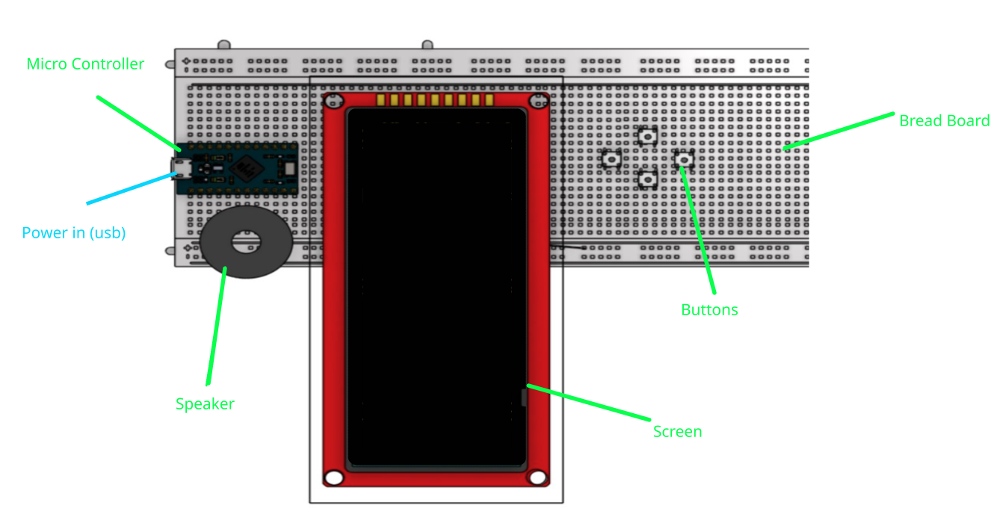

# Micro Proccessor Game Project 
this is an old  project for a basic game on a stm32 micro controller 
it would use the screen on the circuit board to draw characaters to the screen and on each system tick 

it worked off of 4 directional buttons that would allow the user to move a small character around the screen
- the character would collect small coins to increase the users score
- at the same time an npc (non player character) would move around at random with collision detection so it wont hit a go through the edge of the screen 
- at any point of the user touches off of the npc it will remove one of the lives from the the user

--- 

# sprites 
the game worked with 2 characters and a coin 
each character had a different sprite for each direction and would swap between each of them depending on their direction of movement 
- to save on memory in the microcontroller each sprite was only 16x16 so they would only take ~2.048 Kb
- to save on space even more i thought it was benifical to mirror the images so i would only need the one image for left and right movement

## main character 
|  |  |  |  |
- these are the assets used for the main character they are difficult to see as they are only 16x16

## non player character 
|  |  |  |
- these are the assets used for the non player character also 16x16

# circuit board 
the game was run entirely off of the micro controller, the microcontroller also had a bread board that allowed to add a screen and buttons or lights 
- this made the game playable to the user.

below is a mockup of the circuit board used for the game 
 

- the bread board allows all of the components to be put together without the use of soldering the diagram does not involve any of the witres that would connect the compontents for simplicity

## inputs 
**Buttons** 
- there are 4 buttons that the user can use to control the characters movement

## outputs 
**Speaker** 
- makes a beep to show events in the game
- can play background music in the game

**screen** 
- shows all of the movements and proccesses to the user
- gives real time feed back
